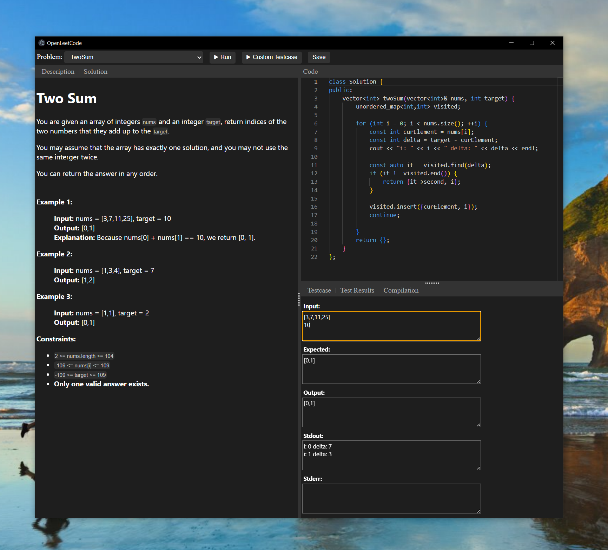

OpenLeetCode - An open source version of LeetCode
--------------------------------------------------------
Welcome to the OpenLeetCode Project!

The motivation behind this project is to be able to practice LeetCode problems on a plane without requiring an internet connection (until Starlink ramps up). This project is not intended to replace or replicate leetcode.com.

## Table of Content
- [OpenLeetCode - An open source version of LeetCode](#openleetcode---an-open-source-version-of-leetcode)
- [Table of Content](#table-of-content)
- [Screenshot](#screenshot)
- [Build](#build)
	- [Windows](#windows)
		- [Building without UI](#building-without-ui)
		- [Building with UI](#building-with-ui)
	- [Unix](#unix)
		- [Building without UI](#building-without-ui-1)
		- [Building with UI](#building-with-ui-1)
- [Run](#run)
	- [Windows](#windows-1)
		- [CLI](#cli)
		- [UI](#ui)
		- [CLI](#cli-1)
		- [UI](#ui-1)
- [How To Use](#how-to-use)
- [List of LeetCode Problems](#list-of-leetcode-problems)
- [Usage](#usage)
- [Note](#note)
- [Requirements](#requirements)
		- [Additional Requirements for the UI](#additional-requirements-for-the-ui)
- [Contributing](#contributing)


## Screenshot


## Build
### Windows
#### Building without UI
```cmd
git clone https://github.com/mbucko/openleetcode
cd openleetcode
.\install --prefix=./install
```
#### Building with UI
```cmd
git clone https://github.com/mbucko/openleetcode
cd openleetcode
.\install --prefix=./install --enable_ui
```
### Unix
#### Building without UI
```bash
git clone https://github.com/mbucko/openleetcode
cd openleetcode
./install.sh --prefix=./install
```
#### Building with UI
```bash
git clone https://github.com/mbucko/openleetcode
cd openleetcode
./install.sh --prefix=./install --enable_ui
```
## Run
### Windows
#### CLI
```cmd
dir install/OpenLeetCode
./openleetcode --language cpp --problem TwoSum
```
#### UI
```bash
dir install/OpenLeetCode
./openleetcodeui
```
### Unix
#### CLI
```bash
cd install/OpenLeetCode
./openleetcode.sh --language cpp --problem TwoSum
```
#### UI
```bash
cd install/OpenLeetCode
./openleetcodeui.sh
```
NOTE: UI for unix is yet to be tested.

## How To Use
After the build succeeds, the following directory structure will be generated:

- problems
  - NumberOfIslands
    - cpp
      - solution.cpp
      - ...
    - testcases
      - TestCase1.test
      - TestCase2.test
      - ...
    - description.md
  - TwoSum
    - ..
- launguage
    - cpp

Just like for LeetCode, you have one file where you solve the problem. For example, the problem called TwoSum has **problems/TwoSum/cpp/solution.cpp**. To add new test cases, you can create a file in the **problems/TwoSum/testcases/** directory with the file extension **.test**, and the solution will automatically be tested against it.

Each problem is described in the ***description.md*** file location in the problem's directory. For example ***problems/TwoSum/description.md***.

The format of the .test files are as follows:

```text
<arg1>
<arg2>
<expected results>
```

The supported types are: integral type, a string, TreeNode structure, boolean or an array. For example:

```text
["1", "2", "4"]
8.0
[0, 0]
```

A ThreeNode structure is represented in an array-based structure. For example an array representation `[1, 2, null, null, 3]` results to the following structure:

      1
     / \
    2   3

## List of LeetCode Problems
* TwoSum
* LongestSubstringWithoutRepeatingCharacters
* NumberOfIslands
* CheckCompletenessOfABinaryTree

The problem names are automatically extracted from the **problems** folder.

## Usage
```text
$ python openleetcode.py --help
usage: openleetcode.py [-h] [--language {cpp}] [--list-problems] [--list-testcases] [--problem problem_name] [--problem_builds_dir dir] [--testcase testcase_name] [--verbose]

OpenLeetCode problem builder. This script builds and tests LeetCode-like problems locally. Currently, it only supports the C++ language, but it can be extended to support other languages.

options:
  -h, --help            show this help message and exit
  --language {cpp}, -l {cpp}
                        The programming language.
  --list-problems       List problems.
  --list-testcases      List testcases for a problem specified with '--problem' option.
  --problem problem_name, -p problem_name
                        Name of the problem to build and test. Default: TwoSum. Use --list-problems to list all problems.
  --problem_builds_dir dir, -d dir
                        Specifies the directory with the problems. Typically, this is './problem_builds'. If not provided, the script defaults to './problem_builds' in the same directory as the executable.
  --run-expected-tests, -r
                        Run the expected solution. Default: False.
  --testcase testcase_name, -t testcase_name
                        Name of the testcase to run. '--testcase All' will run all testcases. Default: All.
  --verbose, -v         Print verbose output
```

## Note
Curently only C++ is supported but the framework is setup such that other languages can be added.

## Requirements
This project requires the following to run:

- Python
- CMake 3.12
- Git

#### Additional Requirements for the UI
- npm

## Contributing
Feel free to contribute with code, test cases, or even code reviews.

For a more in-depth guide on how to contribute and information about the inner workings of OpenLeetCode, please refer to the [Docs](docs/index.md).
You can also join our [Discord chat](https://discord.gg/BzkqubYUm8) if you have any questions about the usage or development.
